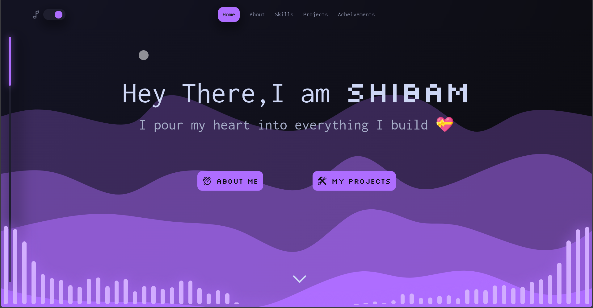
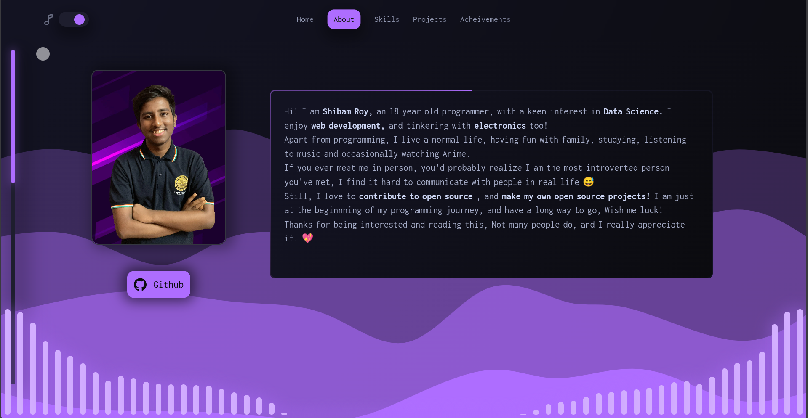

# My Portfolio 💼

## Description 🖋️
This is my portfolio website, rather a remake actually, but with an entirely new design and way better performance than before.
Its made up with [nextjs](https://nextjs.org/). (It's my first time working with nextjs!)

Its live [here](https://shibamroy.vercel.app/).Please check it out!

## What's new?

- A lot and lot of effects, Mostly thanks to [motion](https://motion.dev)
- Relatively, way better performance than its older version
- More responsive than the previous one
- Mostly themed as a purplish neon website

## Screenshots 📷

>[!NOTE]
>Please visit the website for much more details! there are a lot of things other than whatever you can see in these screenshots

## Known bugs 🐞

- Things appear on top of the hamburger menu while its activated, currently I think it is because I made up a lot of stack contexts without thinking, this may take some time to fix... Sorry!

## Contribution ⭐

You're totally free to contribute to this! If you can fix any bug or improve it in any way, I would be grateful 💖

